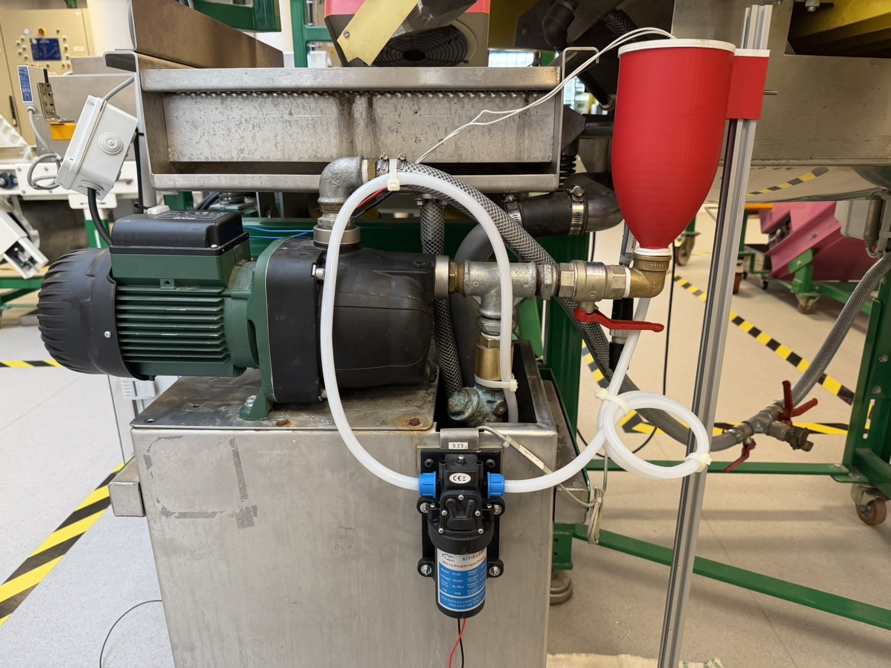
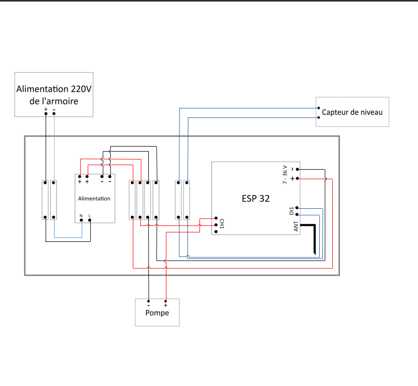
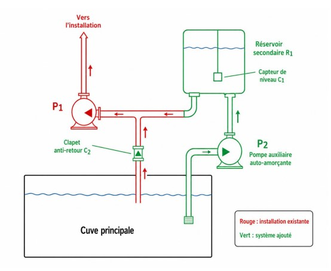

---

title: Conception détaillée
layout: default
nav_order: 4
------------

# Conception détaillée

Cette section présente l'architecture mécanique, hydraulique et électrique du système d'amorçage automatique développé dans le cadre du projet.

L'objectif est de garantir l'alimentation en eau de la pompe principale avant son démarrage afin d'éviter tout fonctionnement à sec susceptible d'endommager les équipements.

---

# Architecture générale du système

Le système est constitué des éléments suivants :

* Une cuve servant de réserve d'eau.
* Un couvercle assurant l'étanchéité du réservoir.
* Une pompe auxiliaire d'amorçage.
* Une pompe principale de nettoyage.
* Un support de pompe imprimé en 3D.
* Une alimentation électrique.
* Un système de commande.

Le fonctionnement général repose sur l'utilisation d'une réserve d'eau permettant à la pompe auxiliaire de remplir le circuit avant la mise en route de la pompe principale.

---

# Schéma fonctionnel

```text
Cuve de stockage
        │
        ▼
Pompe auxiliaire
        │
        ▼
Circuit d'amorçage
        │
        ▼
Pompe principale
        │
        ▼
Nettoyage
```

---

# Conception mécanique

## Cuve

La cuve constitue la réserve d'eau nécessaire au fonctionnement du système.

Elle a été conçue afin de :

* Stocker le volume d'eau nécessaire à l'amorçage.
* Garantir l'étanchéité du système.
* Permettre une fabrication simple par impression 3D.



### Modèle CAO

[Ouvrir le modèle Onshape](https://cad.onshape.com/documents/6e1c8e487ed0883544359069/w/e8721b81bab6da346364b740/e/4b306e95fc1c7976077b1691)

---

## Couvercle

Le couvercle assure la fermeture du réservoir.

Ses principales fonctions sont :

* Prévenir les fuites.
* Protéger le liquide contre les contaminations extérieures.
* Permettre l'intégration des différents raccords.


### Modèle CAO

[Ouvrir le modèle Onshape](https://cad.onshape.com/documents/bf3730f61decd7ed9248a76a/w/5105be7fe3059fdcb56a1324/e/0b04e27af5e27b6db5e7dc92)

---

## Support de pompe

Le support de pompe permet la fixation mécanique de la pompe auxiliaire.

Les critères retenus lors de sa conception sont :

* Rigidité suffisante.
* Faible encombrement.
* Simplicité de fabrication.
* Résistance aux vibrations.


### Modèle CAO

[Ouvrir le modèle Onshape](https://cad.onshape.com/documents/296a5be8c0ab03996c8112af/w/6ff91ac11c5d4f26e0db8d3c/e/5a4104adc5a8d0b4c39f4827)

---

## Pied

Le pied assure la stabilité globale de l'ensemble.

Ses fonctions sont :

* Supporter la masse du système.
* Réduire les mouvements parasites.
* Faciliter l'intégration dans la mini-usine.


### Modèle CAO

[Ouvrir le modèle Onshape](https://cad.onshape.com/documents/12021a1a71f227bb0c9d1fb7/w/e23dd1b24aff4961d910d315/e/29c2ff7fc65d679e9f673775)

---


# Schéma électrique

Le schéma électrique présente l'ensemble des composants nécessaires à l'alimentation et à la commande du système.



Le circuit comporte :

* L'alimentation principale.
* Les protections électriques.
* Les organes de commande.
* La pompe auxiliaire.
* La pompe principale.

Cette architecture permet de sécuriser le fonctionnement du système tout en assurant une séquence d'amorçage fiable.

---

# Prototype réalisé

La figure suivante présente le prototype final assemblé.



L'ensemble des composants mécaniques, hydrauliques et électriques est intégré dans une structure compacte destinée à être utilisée dans le cadre de la mini-usine pédagogique.

---

# Logique de fonctionnement

Le système suit la séquence suivante :

1. Mise sous tension.
2. Vérification des conditions de démarrage.
3. Activation de la pompe auxiliaire.
4. Remplissage du circuit.
5. Amorçage de la pompe principale.
6. Fonctionnement normal.
7. Arrêt du système.

Cette séquence permet d'éviter les risques liés au fonctionnement à sec tout en garantissant une mise en service reproductible.
